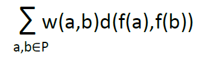

#Projet d'optimisation discrète

##Quadratic Assignment Problem

**1. Décrire les instances de Taillard (taille de 12 à 100)**

Les instances de taillard utilisée ici sont formatées en 3 parties
-   la dimension `n`, comprise en 12 et 100
-   une matrice ``n^2`` décrivant les poids entre les équipements, notée ``w(a,b)``
-   une matrie ``n^2`` décrivant les distances entre les emplacements, notée ``d(a,b)``

On cherche une bijection notée ``f`` de ``n`` dans ``n``, de permutation qui minimiserait la fonction suivante :

Il est a prendre en compte qu'ici les matrices utilisées sont symétriques.

**2. Expliquer et décrire les voisinages utilisés**

**3. Implémenter le recuit simulé et la méthode Tabu**

**4. Justifier vos choix de paramétrage en décrivant les éventuels tests réalisés**

**5. Appliquer vos algorithmes sur toutes les instances « Tai..a » de Taillard et commenter les résultats. Adapter ou 
modifier vos choix précédents en fonction de la qualité de ces résultats**
   
**6. Réaliser une étude comparative des deux méthodes utilisées**